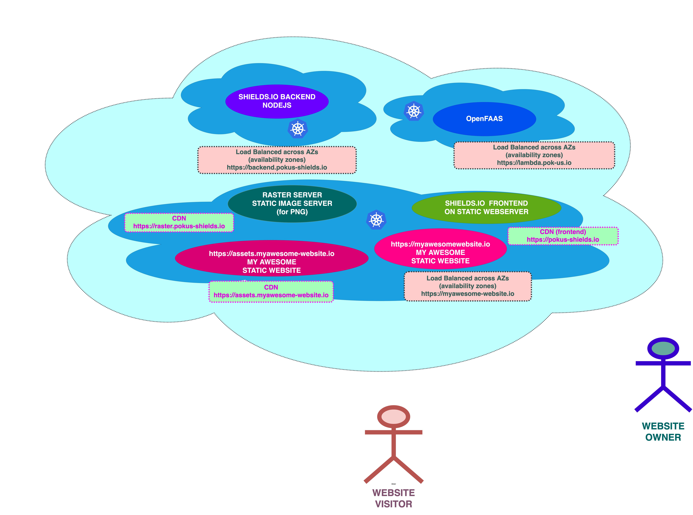

# The Shields Experiment

One day, i learned how quickly you can set up a visitor counter using `visitor-badge.glitch.me`.

That Day, I realized how beautifully powerful the badge pattern can be: try implement a visitor counter yourself, from scratch, that can count visits with a different counter for every page...

All in all, this work is about designing an architecture for a static website :
* the static website is managed with one of the following CMS :
  * `hugo`
  * `Gatsby`
  * `Directus`

## Architecture

## DevOps

## References

* Shields.io :
  * https://shields.io/category/social
  * oh  purée tous les compteurs !!!
  * chercher le compteur de visites
* Host your own:
  * about running : https://github.com/badges/shields/blob/master/doc/self-hosting.md
  * about secrets management : https://github.com/badges/shields/blob/master/doc/server-secrets.md
  *

* About the CDN topic :
  * that's where I wanna go
  * I wanna provide a solution where we nuild our own dedicated CDN, using `KubeCDN`
  * One tutorial about `KubeCDN` : https://blog.insightdatascience.com/how-to-build-your-own-cdn-with-kubernetes-5cab00d5c258
  * `KubeCDN` repo :
## About Secrets Management and CORS

It is possible to provide a token or credentials for a number of external services:
*  Like a private `Drone CI`, or a private `Gitea`
*  These may be used to lift a rate limit or provide access to private resources from a self-hosted instance.
