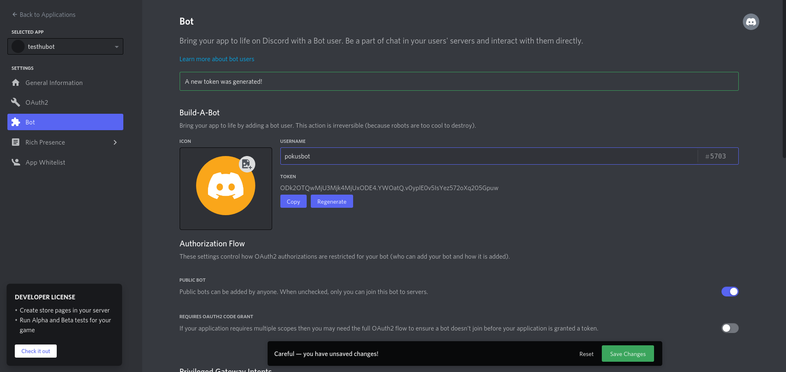

# Spawn me

* generate code :
```bash

sudo npm install -g yo generator-hubot
mkdir myhubot
cd myhubot
yo hubot
npm i -s hubot-discord
sudo npm install -g hubot-discord
```
* get your discord bot token from your discord account, by "creating a bot" (discord terminology) :



* Note in the screenshot i named `pokusbot` the discord bot i created: that is the name that we are going to use to send commands to the discord server.
* start the bot, execute the `deploy` command : this comand gives an example of how to use any npm package, here i used `shelljs` (can be use to execute git commands), the command creates a markdown file locally. I will later use rxjs to send http request to circleci api, or to git clone source code, hugo build and deploy a given version number or git branch ot git tag. All I need left is knowing how to pass parameters to bot

```bash
export HUBOT_DISCORD_TOKEN="ODk2OTQwMjU3Mjk4MjUxODE4.YWOatQ.1ojq1MIZ8bLstM2RVV_4c-RJDXk"
export HUBOT_MAX_MESSAGE_LENGTH="2000"
export HUBOT_HEROKU_KEEPALIVE_URL='nimportequoi://ahouaisdaccord.io'
bin/hubot --name bernardbot
# an hen execute comand :
bernardbot map me "2 avenue de 'lunion soviétque clermont ferrand"
@bernardbot open the pod bay doors
bernardbot deploy awesometreesio.io git@github.com:territoires-et-futurs/siteweb.git develop git@github.com:zhaohuabing/hugo-theme-cleanwhite.git master
```

* so here the `bernardbot deploy awesometreesio.io git@github.com:territoires-et-futurs/siteweb.git develop git@github.com:zhaohuabing/hugo-theme-cleanwhite.git master` command :
  * is triggered providing parameters
  * the `shelljs` npm package is used to :
    * create a file with provided parameter values
    * `git clone`s the specified git repo, checkut the specifed git version, and run the hugo build
  * only one left thing to do : check that exactly 3 parameters were passed, not less, not more
* version control init :

```bash


git init
# git add -A && git commit -m "Initial commit" && git push -u origin master
git add -A && git commit -m "Initial commit" && git flow init --defaults
git remote add github ${YOUR_REMOTE_URI} && git push -u github master
git remote add gitlab ${YOUR_GLB_REMOTE_URI} && git push -u gitlab master


```


### ANNEX: References

* https://hubot.github.com/docs/
* https://hubot.github.com/docs/scripting/
* https://www.npmjs.com/package/shelljs
* https://www.youtube.com/watch?v=kCGeB3ewHyA
* https://www.youtube.com/watch?v=BevcvRLsa9Y
